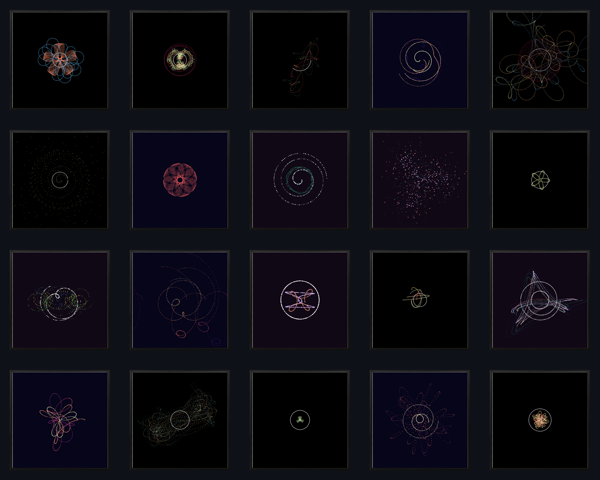

# Creative Coding
A collection of somewhat artistic implementations of numerous mathematical sensations and experiments.   
Inspired by [The Coding Train](https://www.youtube.com/c/TheCodingTrain) and various generative art conference talks, empowered by [p5py](https://github.com/p5py/p5).

## Worley Noise

## Branching

## Lissajous-esk art

Depicting complex harmonic motion by highlighting axis points over time.   
Basis are multiple connected and randomized harmonic motions that use the end point of their predecessor as a starting point.
Combining interdependently randomized parameters (axis length, rotating speed, visbility, size, ...) with common matplotlib color maps yields subjectively beautiful visuals.

## Maurer-Rose
Interactive implementation of the [maurer rose](https://en.wikipedia.org/wiki/Maurer_rose) that allows visualizations for random parameters.  

## Perlin Terrain
Procedual terrain generation based on the [perlin noise](https://en.wikipedia.org/wiki/Perlin_noise).  

## Ray Casting
Experimenting with simplistic ray casting utilizing basic [line segmentation intersection](https://en.wikipedia.org/wiki/Line%E2%80%93line_intersection) math.

