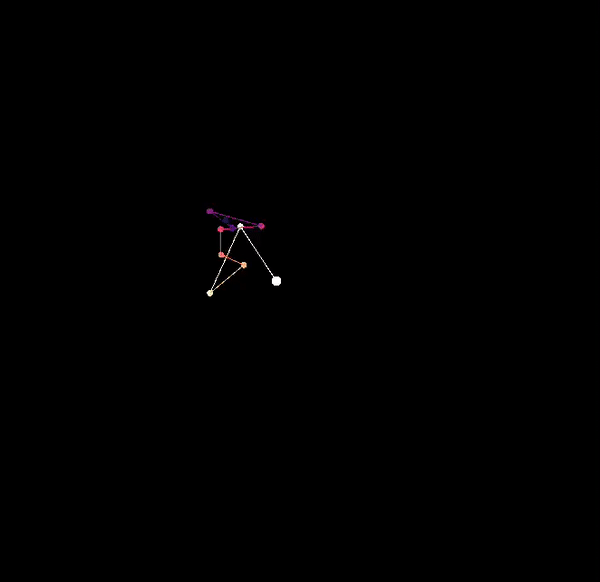

# Creative Coding
A collection of somewhat artistic implementations of numerous mathematical sensations and experiments.   
Inspired by [The Coding Train](https://www.youtube.com/c/TheCodingTrain) and various generative art conference talks, empowered by [p5js](https://p5js.org/) and its python counterpart [p5py](https://github.com/p5py/p5).

## Forest on fire
Simulation of a burning forest. Guided by an initial population, tree spawn and fire spawn probability. A fire can spread to surrounding trees and lives only for a single frame. Quite close code replication of [this video](https://www.youtube.com/watch?v=lJ2VlcI_JuY).

## Style transfer
Combining the content of an image with the style of another utilizing the [Style Transfer](https://www.cv-foundation.org/openaccess/content_cvpr_2016/papers/Gatys_Image_Style_Transfer_CVPR_2016_paper.pdf) approach. Tutorial available [here](https://colab.research.google.com/drive/1rXkHKJzH9u2hs-OAqxDLNvotVxieg9S1#scrollTo=jxRrLNslsI2w)

Content | Style | Result
--- | --- | ---
 |  | 
 |  | 
 |  | 
 |  | 

## Mandelbrot Set
Visualization of a zoom into the [Mandelbrot Set](https://en.wikipedia.org/wiki/Mandelbrot_set).  

## Sierpinski Triangle (Chaos Game)
Implementation of the [Chaos game](https://en.wikipedia.org/wiki/Sierpi%C5%84ski_triangle#Chaos_game) to visualize the Sierpinski Triangle.  

## Worley Noise
Visualization of a randomized and tuned [Worley-Noise](https://de.wikipedia.org/wiki/Worley_noise) implementation.

## Branching
Recursive branch visualization

## Lissajous-esk art

Depicting complex harmonic motion by highlighting axis points over time.   
Basis are multiple connected and randomized harmonic motions that use the end point of their predecessor as a starting point.
Combining interdependently randomized parameters (axis length, rotating speed, visbility, size, ...) with common matplotlib color maps yields subjectively beautiful visuals.

## Maurer-Rose
Interactive implementation of the [maurer rose](https://en.wikipedia.org/wiki/Maurer_rose) that allows visualizations for random parameters.  

## Perlin Terrain
Procedual terrain generation based on the [perlin noise](https://en.wikipedia.org/wiki/Perlin_noise).  

## Ray Casting
Experimenting with simplistic ray casting utilizing basic [line segmentation intersection](https://en.wikipedia.org/wiki/Line%E2%80%93line_intersection) math.

